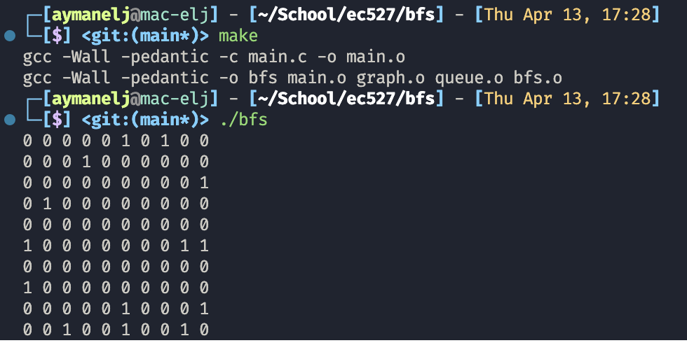

# Breadth-First Search Using CUDA

Breadth-first search (BFS) is an algorithm for searching a tree data structure for a node that satisfies a given property. It starts at the tree root and explores all nodes at the present depth prior to moving on to the nodes at the next depth level. Extra memory, usually a queue, is needed to keep track of the child nodes that were encountered but not yet explored.

This project analyzes three implementations of breadth-first search:

1. Serial version
2. Multi-threaded version
3. CUDA version

### Prerequisites

C language
GPUs
[add more]

### Instructions

To run the experiment, compile and execute using the following terminal commands.

```
make
./bfs
```

To run the cuda version, use the following commands
First, find your GPU model:
```
nvidia-smi
```
The output in this case:
+-----------------------------------------------------------------------------+
| NVIDIA-SMI 450.57       Driver Version: 450.57       CUDA Version: 11.0     |
|-------------------------------+----------------------+----------------------+
| GPU  Name        Persistence-M| Bus-Id        Disp.A | Volatile Uncorr. ECC |
| Fan  Temp  Perf  Pwr:Usage/Cap|         Memory-Usage | GPU-Util  Compute M. |
|                               |                      |               MIG M. |
|===============================+======================+======================|
|   0  Quadro P1000        Off  | 00000000:01:00.0 Off |                  N/A |
| N/A   29C    P8    N/A /  N/A |    344MiB /  4039MiB |      0%      Default |
|                               |                      |                  N/A |
+-------------------------------+----------------------+----------------------+
                                                                               
+-----------------------------------------------------------------------------+
| Processes:                                                                  |
|  GPU   GI   CI        PID   Type   Process name                  GPU Memory |
|        ID   ID                                                   Usage      |
|=============================================================================|
|    0   N/A  N/A      4000      G   /usr/bin/X                        341MiB |
+-----------------------------------------------------------------------------+

Next, load the compiler for your GPU compiler:
```
module load cuda
```
([cuda] was dependent on the type of GPU being used in this case)

Finally, to compile CUDA program:
```
nvcc -arch sm_35 bfs_cuda.cu -o bfs_cuda
```


## Project Overview

Sample adjacency list output with 10 vertices and a maximum degree of 3.



### Problem


### Solution


### Serial Implementation


### Multi-threaded Implementation


### CUDA Implementation

CUDA® is a parallel computing platform and programming model developed by NVIDIA for general computing on graphical processing units (GPUs). With CUDA, developers are able to dramatically speed up computing applications by harnessing the power of GPUs.


### Analysis


### Results


### References

https://en.wikipedia.org/wiki/Breadth-first_search

https://docs.nvidia.com/cuda/cuda-c-programming-guide/

